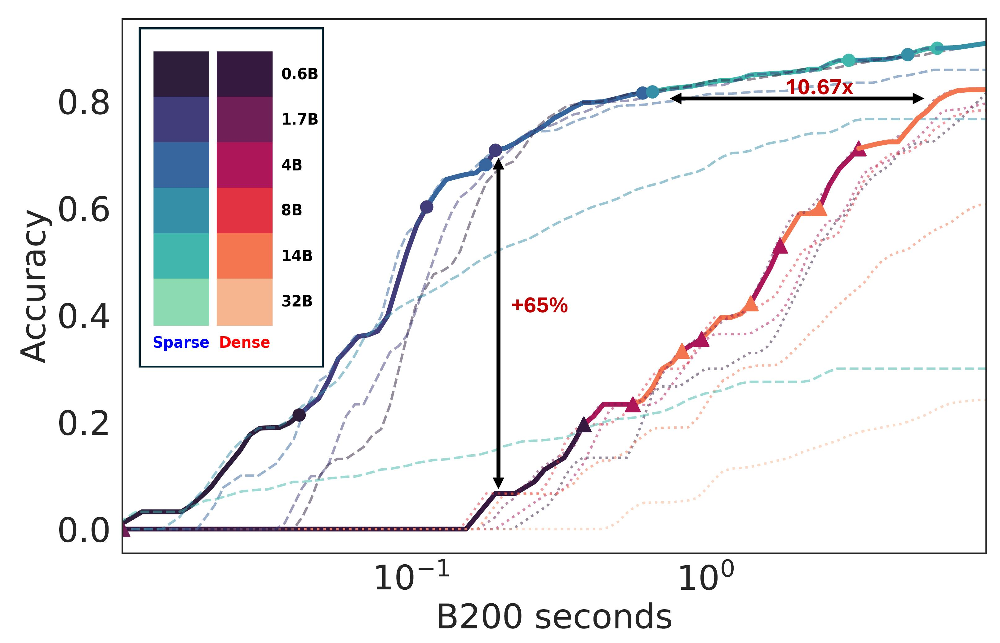
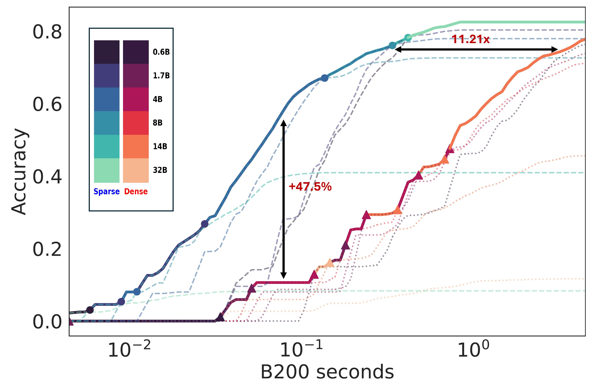

# Kinetics: Rethinking Test-Time Scaling Laws
This repository provides the accompanying code for **Kinetics: Rethinking Test-Time Scaling Laws** [[Paper]](https://arxiv.org/abs/2506.05333) [[Blog]](https://infini-ai-lab.github.io/Kinetics/)

### TL;DR
We introduce **Kinetics**, which challenges the traditional test-time scaling (TTS) laws by adopting a *practical efficiency* perspective. It reveals that prior compute-optimal approaches overlook major *key-value memory access bottlenecks* in various TTS strategies. By jointly considering memory and compute, the **Kinetics scaling law** shows that it is more efficient to scale model size up to a threshold before investing more compute in test-time scaling. Motivated by this, we propose a new scaling paradigm centered on **sparse attention**, which lowers per-token cost and enables longer generations and more parallel samples within the same resource budget. 

We provide AIME24 and AIME25 reasoning traces for Qwen3 model series and its sparse attention variants through [Huggingface](https://huggingface.co/datasets/InfiniAILab/Kinetics-generations)

In this codebase, we provide,
1. eFLOPs-based cost model analysis
2. Comparison of previous and Kinetics scaling law
3. Comparison of dense and sparse scaling law based on eFLOPs based cost model
4. Block Top-K attention speed-up demonstration

## Repository Structure
The repository is organized as follows,

```
Kinetics/
├── benchmark/
|   ├──blocktopk.py
|   └──dense.py
├── cost_model
|   ├── best_of_N
|   |   ├── cost_model_ntrial.py
|   |   ├── frontier_numTrials.ipynb
|   |   └── compare_sparse_numTrials.ipynb
|   ├── long_CoT
|   |   ├── cost_model_genlen.py
|   |   ├── frontier_genlen.ipynb
|   |   └── compare_sparse_genlen.ipynb
|   ├── utils.py
├── README.md
└── requirements.txt
```
- `cost_model/`: contains code to perform eFLOPs-based cost analysis for two different inference-scaling strategies - best of N and long CoT.
- `benchmark/`: contains code for benchmarking the task throughput with block top-k and dense attention-based model. 

### Installation
```
conda create -n kinetics python=3.11
conda activate kinetics

# install flashinfer v0.1.6
wget https://github.com/flashinfer-ai/flashinfer/releases/download/v0.1.6/flashinfer-0.1.6+cu124torch2.4-cp311-cp311-linux_x86_64.whl#sha256=19a01e2ec93662bc6b83819daaae277d93e7cc989343c5f8940af44a4cb66ba0
pip install -r requirements.txt
```

### Usage
Download the reasoning traces from [Huggingface](https://huggingface.co/datasets/InfiniAILab/Kinetics-generations)

The samples are saved as jsonl files. Every example dict contains the following keys:
- `query`: question text
- `choice`: ground-truth output list
- `prediction`: output prediction text list
- `score`: 0.0 or 100.0
Each example is replicated 32 times (32 max trials). For 32B, we only provide 8 trials.

#### Cost Estimation
Compute inference cost and accuracies for different test-time configurations (number of trials and generation lengths).
```
cd cost_model
python3 best_of_N/cost_model_ntrial.py <path_to_response_root> <method>

python3 best_of_N/cost_model_genlen.py <path_to_response_root> <method>
```
**Args:**
- `<response_root>`: Dataset directory (e.g., `AIME24`, `AIME25`)
- `<method>`: One of `dense`, `topk`, `blocktopk`

#### Test-time Pareto Optimal Frontier
First generate cost analysis csv files using the scripts mentioned above. Then refer to `cost_model/best_of_N/frontier_numTrials.ipynb` and `cost_model/long_CoT/frontier_genlen.ipynb` to obtain the accuracy vs cost budget pareto curves for dense and the sparse variants using **best of N** and **long CoT** scaling stratgies respectively.

<table>
  <tr>
    <td>
      <figure>
        
        <figcaption>Figure 1: Top-k Sparse Scaling on AIME24 (Best-of-N)</figcaption>
      </figure>
    </td>
    <td>
      <figure>
        
        <figcaption>Figure 2: Top-k Sparse Scaling on AIME24 (long-CoT)</figcaption>
      </figure>
    </td>
  </tr>
</table>

#### Benchmark Block TopK Attention throughput
Contains paged-attention implementation of dense attention and block top-k attention. We only provide implementation for 1 decoder layer, considering n-way Tensor Parallelism (n is the number of key-value heads).
```
python3 benchmark/dense.py <model>
python3 benchmark/blocktopk.py <model>
```

### TODOs
- [ ] Block TopK Attention + Paged Attention Kernels
- [ ] Integration into SGLang  
